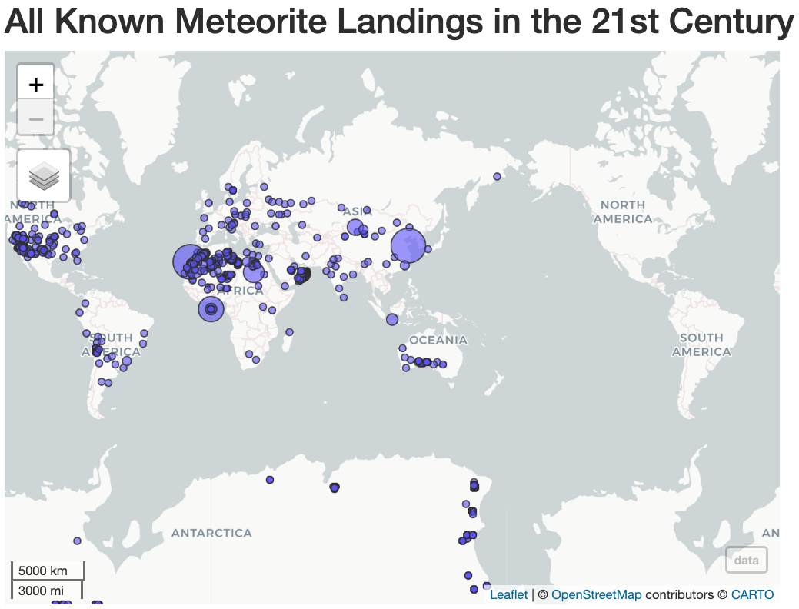

# voyage-project-tier1-fireball

## Table of Contents

* [Overview](#overview)
* [General Instructions](#general-instructions)
* [Requirements & Specifications](#requirements-specifications)
* [Acknowledgements](#acknowledgements)
* [About Chingu](#about-chingu)

## Overview

[Meteorite strikes](https://rpubs.com/ag1712/1059267) occur when the orbit of a 
meteorite travels close enough to the Earth to be captured by its gravity field. 
The U.S. National Aeronautics & Space Administration 
(NASA) maintains a dataset of all known (>45K) meteorite strikes and sponsors research 
on these events.

Your Chingu Voyage team will be using this data to create an app that will help 
anyone interested in these events explore this data in novel ways. Your app will
summarize this data and will allow users to select subsets of it for more
detailed analysis.

This will provide you with an opportunity to build Web Development experience
dealing with large volumes of data, data analysis using statistics, and user
queries.

## General Instructions

This project is designed to be worked on by a team rather than an individual
Chingu. This means you and your team will need to thoroughly read and
understand the requirements and specifications below, **_and_** define and
manage your project following the _Agile Methodology_ defined in the
[Voyage Handbook](https://chingucohorts.notion.site/Voyage-Guide-1e528dcbf1d241c9a93b4627f6f1c809).

As you create this project make sure it meets all of the requirements, but once
it reaches MVP, start implementing the optional features or get creative and
extend it in ways we haven't envisioned. In other words, use the power of
teamwork to make it distinctive and unique.

Take note that we haven't given specific direction on what your UI/UX should
look like. This is another area where you and your team can put your creativity 
to work! 

## Requirements & Specifications

### What You Need to Do

The following define the minimum requirements and ideas for features you may
implement to enhance this app, if time permits.

#### Structure

- [ ] This is a purely frontend application. No backend is required. 
- [ ] You may use any languages, tools, or libraries you prefer when designing and building this app. 
- [ ] We've included a CSV file containing the raw data in the `/assets` directory in this repo. But, if you choose, you may use the [Public API](https://data.nasa.gov/resource/gh4g-9sfh.json) instead.
- [ ] You may **_NOT_** use AI-base solution generators like GitHub CoPilot.
- [ ] Useful links and resources:
    - [Meteorite Landings and Near Earth Objects](https://rpubs.com/ag1712/1059267)
    - [Public API](https://data.nasa.gov/resource/gh4g-9sfh.json)

#### Styling

- [ ] Surprise us!!! Use your teams creativity to make this app distinctive.
- [ ] Add a footer containing a link to your teams GitHub repo
- [ ] In general, you will find these [UI design principles](https://www.justinmind.com/ui-design/principles) helpful.
- [ ] Recommend using this resource for [clean CSS](https://www.devbridge.com/articles/implementing-clean-css-bem-method/)

#### Functionality

-   User can see a landing page containing at least the following components:
    - [ ] Search fields allowing them to customize the detail data display
    - [ ] A scrollable detail data display containing the meteorite strike history based on the search criteria. 
    - [ ] A summary metrics component:   

- Search Component
    - [ ] User will be able to filter data in the search component by any of the following:
        - Name
        - Year of strike
        - Meteorite composition (`recclass`)
        - Mass range (e.g. low to high, inclusive)
    - [ ] There should be a 'Clear' button that's part of the search component. When clicked this will clear any search criteria and reset the detail data display and summary metrics to use the entire data set.
    - [ ] There should be a 'Search' button in the search component to perform the search based on the user input. When the search finishes the detailed data display should be updated with the filtered results of the search operation.

- Detail Data Display Component
    - [ ] Displays one row for each meteorite strike in the data set.
    - [ ] If no search criteria has been selected then the summary metrics will be for all meteorite strikes.

- Summary Metrics Component
    - [ ] Displays the following metrics for the data that has been selected:
        - Total number of strikes
        - Average mass
        - Histogram showing number of strikes by year
        - Histogram showing number of strikes by meteorite composition (`recclass`).
    - [ ] If no search criteria has been selected then the summary metrics will be for all meteorite strikes.
    
### Extras (Not Required)

-   Search Component
    - [ ] Allow search criteria to be saved across sessions and reselected from a dropdown
-   Detail Data Display Component
    - [ ] Display a clickable button in the column heading to allow the user to sort in ascending or descending sequence based on that column.
    - [ ] Display a clickable button in the column heading to display a popup dialog with a definition of what data is contained in the column.
-   Summary Metrics Component
    - [ ] In addition to the metrics for the selected data, also display these metrics for the entire data set. This should be suppressed if there is no search criteria so the display isn't duplicated.
       - Total number of strikes
       - Average mass
       - Histogram showing number of strikes by year
       - Histogram showing number of strikes by meteorite composition (`recclass`). 
-   General
    - [ ] Support dark/light mode
    - [ ] Allow the user options for customizing the font and font size

## Acknowledgements

Thanks to NASA and it's partners for open sourcing this data. You can find more
at [NASA Open Data Portal](https://data.nasa.gov/). 

## About Chingu

If you aren’t yet a member of Chingu we invite you to join us. We help our 
members transform what they’ve learned in courses & tutorials into the 
practical experience employers need and want.